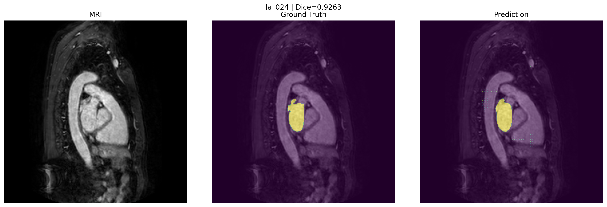

# 3D Cardiac MRI Segmentation using PyTorch & MONAI

A deep learning project for automatic cardiac MRI segmentation using a 3D U-Net architecture with PyTorch and MONAI.

## Overview

This project implements a complete medical image segmentation pipeline, including:

- NIfTI (`.nii.gz`) medical image loading
- MONAI-based preprocessing
- 3D U-Net model training
- Dice coefficient evaluation
- Sliding window inference
- Segmentation visualization

The goal is to predict voxel-level segmentation masks from cardiac MRI volumes.

---

## Dataset

**Medical Segmentation Decathlon - Task02 Heart**

The dataset contains cardiac MRI volumes and corresponding segmentation labels.

Dataset format:
.nii.gz

The dataset is not included in this repository due to size limitations.

---

## Model

Architecture:

**3D U-Net**

Features:

- 3D convolution layers
- Encoder-decoder architecture
- Skip connections
- Multi-scale feature extraction

Training configuration:

Optimizer: AdamW
Loss: DiceCELoss
Epochs: 100
Mixed Precision: AMP (FP16)
Inference: Sliding Window

---

## Results

Best validation Dice score:
0.8821

Example prediction:

---

## Installation

Clone the repository:

git clone https://github.com/aradmanamnaoon/medical-image-segmentation.git

cd medical-image-segmentation

## Install dependencies:

pip install -r requirements.txt
